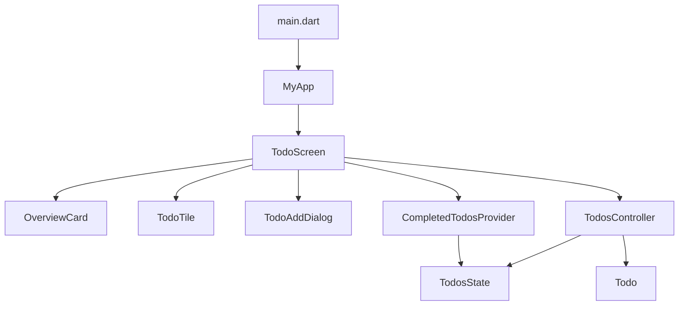
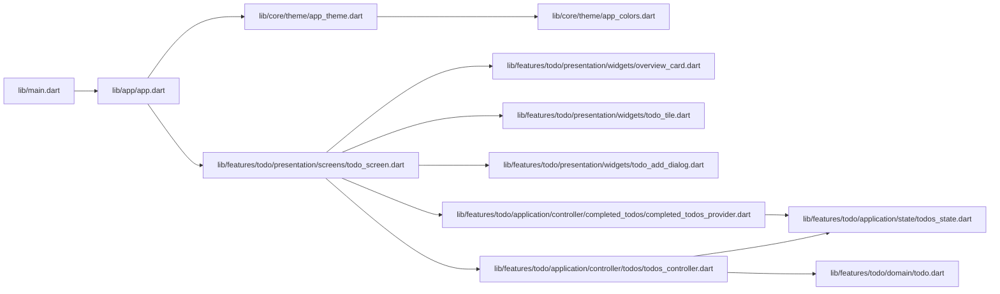
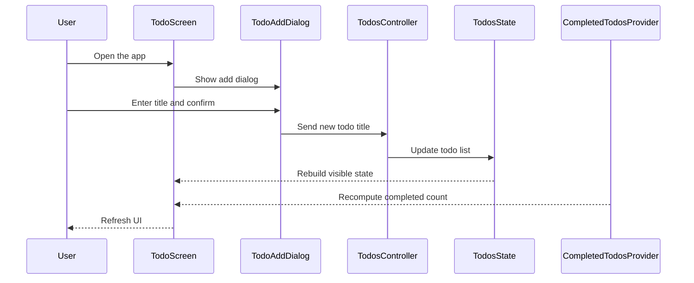

# TickIt

TickIt is a Flutter application for managing a simple todo workflow with a clean, layered architecture. The codebase is organized to help the next developer quickly understand where UI, state, domain logic, and shared app infrastructure live.

## Project purpose

TickIt focuses on one primary feature: creating, toggling, editing, and deleting todos. The app is intentionally structured around a feature-first design so that future enhancements can be added without scattering responsibilities across the project.

## Tech stack

- Flutter SDK with Dart
- Material 3 design system
- State management: Flutter Riverpod
- Code generation: Riverpod annotations, Freezed, Build Runner
- Linting and quality: flutter_lints, riverpod_lint
- Cross-platform targets: Android, iOS, Linux, macOS, Windows, Web
- UI assets: Cupertino icons

## Architecture overview

The application follows a layered, feature-first structure:

- app/: app shell and top-level composition
- core/: shared theme and design tokens
- features/: isolated business features, currently centered on todo
- main.dart: runtime bootstrap and provider scope setup

Each feature is split into four conceptual layers:

- presentation/: screens, dialogs, and reusable widgets
- application/: controllers, providers, and state objects
- domain/: immutable business models and rules
- data/: place for persistence or repository implementations

## High-level flow



## File connection graph



## UI and state interaction



## Visual module map

```text
lib/
├── main.dart
├── app/
│   └── app.dart
├── core/
│   └── theme/
│       ├── app_colors.dart
│       └── app_theme.dart
└── features/
    └── todo/
        ├── application/
        │   ├── controller/
        │   │   ├── completed_todos/
        │   │   │   └── completed_todos_provider.dart
        │   │   └── todos/
        │   │       └── todos_controller.dart
        │   └── state/
        │       └── todos_state.dart
        ├── domain/
        │   └── todo.dart
        ├── presentation/
        │   ├── screens/
        │   │   └── todo_screen.dart
        │   └── widgets/
        │       ├── overview_card.dart
        │       ├── todo_add_dialog.dart
        │       └── todo_tile.dart
        └── data/
```

## Mindmap of the codebase


## Project structure and responsibilities

### Root entry points

- lib/main.dart
  - Bootstraps the app and wraps it in ProviderScope for Riverpod availability.

- lib/app/app.dart
  - Defines the root MaterialApp.
  - Applies the dark theme and routes the initial screen to TodoScreen.

### Shared infrastructure

- lib/core/theme/app_colors.dart
  - Centralizes color tokens used throughout the UI.

- lib/core/theme/app_theme.dart
  - Builds the shared ThemeData for Material 3 styling.
  - Controls background colors, cards, input fields, and buttons.

### Todo feature

#### Domain layer

- lib/features/todo/domain/todo.dart
  - Defines the Todo model.
  - Uses Freezed to make instances immutable and easy to compare.

#### Application layer

- lib/features/todo/application/state/todos_state.dart
  - Represents the feature state.
  - Stores the todo list, loading flag, and optional error message.

- lib/features/todo/application/controller/todos/todos_controller.dart
  - Main Riverpod controller for todo state.
  - Handles add, toggle, delete, and update operations.
  - Updates the state immutably through copyWith-based transitions.

- lib/features/todo/application/controller/completed_todos/completed_todos_provider.dart
  - Computes the number of completed todos.
  - Keeps derived UI state separate from the main controller state.

#### Presentation layer

- lib/features/todo/presentation/screens/todo_screen.dart
  - Main screen of the app.
  - Watches todo state and the completed-count provider.
  - Renders empty, loading, error, and populated states.

- lib/features/todo/presentation/widgets/overview_card.dart
  - Shows summary progress for completed vs total todos.

- lib/features/todo/presentation/widgets/todo_add_dialog.dart
  - Displays the dialog used to create a new todo.
  - Validates input before forwarding it to the controller.

- lib/features/todo/presentation/widgets/todo_tile.dart
  - Renders a single todo item.
  - Contains the checkbox, title, edit, and delete controls.

#### Data layer

- lib/features/todo/data/
  - Reserved for future persistence, repositories, or API adapters.
  - Keeps storage concerns outside the presentation and application layers.

## Developer navigation guide

If you are changing behavior in the app, the likely starting points are:

- UI changes: lib/features/todo/presentation/
- State changes: lib/features/todo/application/
- Model changes: lib/features/todo/domain/
- App-wide visual rules: lib/core/theme/

## Current implementation notes

- The app already wires the shell, theme layer, and todo feature through Riverpod.
- The core user flow is in place: add todos, toggle completion, delete todos, and view progress.
- The current implementation is still evolving around UI polish and deeper feature expansion.

## Contribution conventions

- Keep new features under lib/features/<feature>/.
- Keep widgets presentational and avoid embedding business rules in UI code.
- Place state transitions and provider logic in application/.
- Keep domain models immutable and focused on business concepts.
- Treat generated files such as .g.dart and .freezed.dart as build artifacts rather than hand-edited sources.
