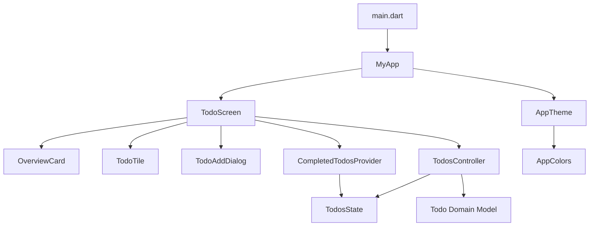
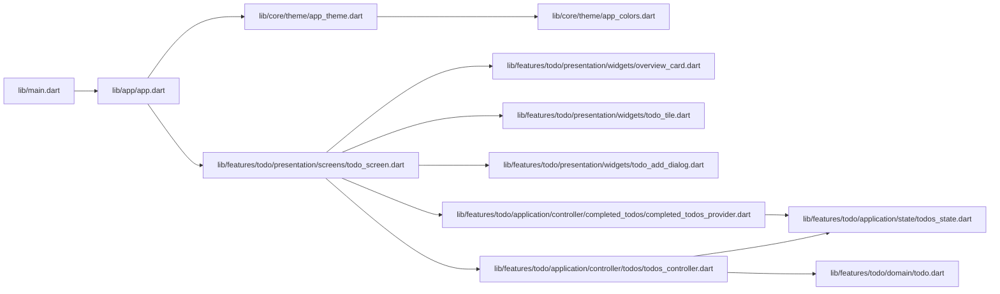
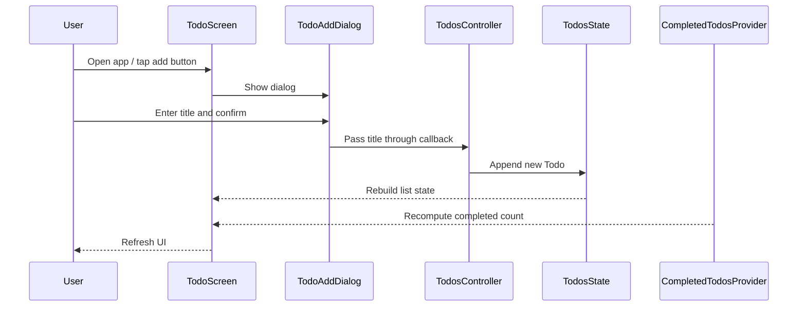
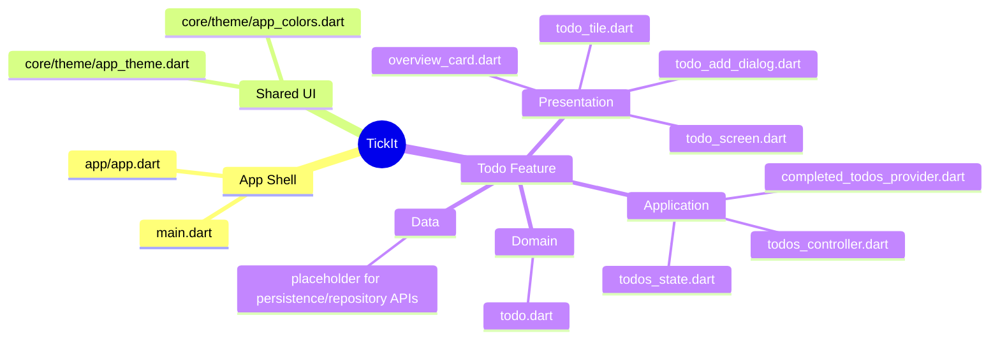

# TickIt

TickIt is a Flutter-based todo application built around a feature-first architecture, Riverpod-driven state management, and a reusable theme system. The project is intentionally structured so a new developer can quickly understand how UI, state, domain models, and shared app infrastructure connect.

## Overview

TickIt currently focuses on one primary feature: managing a simple todo list. The app shell is minimal, while the todo feature is organized into clear layers for presentation, application state, and domain modeling.

## Tech stack

- Flutter SDK with Dart
- Material 3 UI system
- State management: Flutter Riverpod
- Code generation: riverpod_annotation, freezed_annotation, freezed, riverpod_generator, build_runner
- Linting: flutter_lints, riverpod_lint
- Cross-platform targets: Android, iOS, Linux, macOS, Windows, Web
- Icons: cupertino_icons

## Architecture at a glance

The app follows a layered, feature-first structure:

- app/: shell and application-level composition
- core/: shared theme and design tokens
- features/: business features, each isolated in its own folder
- main.dart: bootstrap point that mounts the app and Riverpod provider scope

Each feature is split into:

- presentation/: screens, widgets, dialogs, and UI composition
- application/: providers, controllers, state models, and derived state logic
- domain/: immutable business entities and rules
- data/: persistence or repository adapters (prepared for future expansion)

## High-level system map



## How the app is wired

### Entry point

- main.dart creates the app root and wraps it in ProviderScope, which enables Riverpod state management.

### App shell

- app/app.dart builds the MaterialApp and injects the dark theme plus the initial home screen.

### Theme layer

- core/theme/app_theme.dart defines the shared visual design for the app.
- core/theme/app_colors.dart centralizes color tokens used by the theme.

### Todo feature flow

- TodoScreen is the main view for the feature.
- It watches todo state from TodosController and derived completed-count state from CompletedTodosProvider.
- The screen composes the summary card, list rows, and add-todo dialog.

## File connection graph



## State and UI flow



## Visual module map

```text
lib/
├── main.dart
├── app/
│   └── app.dart
├── core/
│   └── theme/
│       ├── app_colors.dart
│       └── app_theme.dart
└── features/
    └── todo/
        ├── application/
        │   ├── controller/
        │   │   ├── completed_todos/
        │   │   │   └── completed_todos_provider.dart
        │   │   └── todos/
        │   │       └── todos_controller.dart
        │   └── state/
        │       └── todos_state.dart
        ├── domain/
        │   └── todo.dart
        ├── presentation/
        │   ├── screens/
        │   │   └── todo_screen.dart
        │   └── widgets/
        │       ├── overview_card.dart
        │       ├── todo_add_dialog.dart
        │       └── todo_tile.dart
        └── data/
```

## Mindmap of the project



## Detailed module responsibilities

### lib/main.dart

- Application bootstrap point.
- Mounts MyApp inside ProviderScope so Riverpod is available throughout the app.

### lib/app/app.dart

- Builds the top-level MaterialApp.
- Applies the dark theme and routes the home screen to TodoScreen.
- Keeps app-wide UI configuration separate from feature code.

### lib/core/theme/app_colors.dart

- Defines shared color tokens for the app.
- Keeps the visual palette centralized and reusable.

### lib/core/theme/app_theme.dart

- Builds the shared ThemeData.
- Configures Material 3 style defaults, card styling, input decoration, and button appearance.

### lib/features/todo/domain/todo.dart

- Defines the Todo domain entity.
- Uses Freezed to make instances immutable and easier to compare.

### lib/features/todo/application/state/todos_state.dart

- Represents the state consumed by the todo feature.
- Holds the todo list, loading flag, and optional error message.
- Provides an initial state factory for provider bootstrapping.

### lib/features/todo/application/controller/todos/todos_controller.dart

- Implements the primary todo state controller using Riverpod.
- Owns the state and exposes the mutation logic for adding todos.
- Updates the state object immutably through copyWith-based transitions.

### lib/features/todo/application/controller/completed_todos/completed_todos_provider.dart

- Derives a computed value: the number of completed todos.
- Reads the todo list from the controller state without duplicating state logic in the UI.

### lib/features/todo/presentation/screens/todo_screen.dart

- Main screen for the todo feature.
- Watches controller and computed provider values.
- Renders empty/loading/error/list states and composes the feature widgets.

### lib/features/todo/presentation/widgets/overview_card.dart

- Displays a summary of completed vs total todos.
- Provides a simple at-a-glance progress indicator for the feature.

### lib/features/todo/presentation/widgets/todo_add_dialog.dart

- Collects new todo titles from the user.
- Validates the input and invokes the callback that reaches the controller.

### lib/features/todo/presentation/widgets/todo_tile.dart

- Renders a single todo item in the list.
- Shows the checkbox, title, and action icons.
- Currently acts as a presentational widget receiving a Todo model.

### lib/features/todo/data/

- Reserved for future persistence and repository abstractions.
- Keeps data access concerns out of the UI and application layers.

## Current implementation notes

- The app shell, theme layer, and todo feature are already connected and running through Riverpod.
- The main feature flow is in place: add todo, render todo list, and compute completion progress.
- The current implementation is still evolving in the presentation layer, especially around row actions and deeper controller organization.

## Developer conventions

- Add new features under lib/features/<feature>/ using the same layered folder structure.
- Keep UI widgets presentational and avoid placing business rules inside them.
- Put state transitions and provider logic in application/.
- Keep domain models immutable and focused on business concepts.
- Treat generated files such as _.g.dart and _.freezed.dart as build artifacts rather than hand-edited sources.
