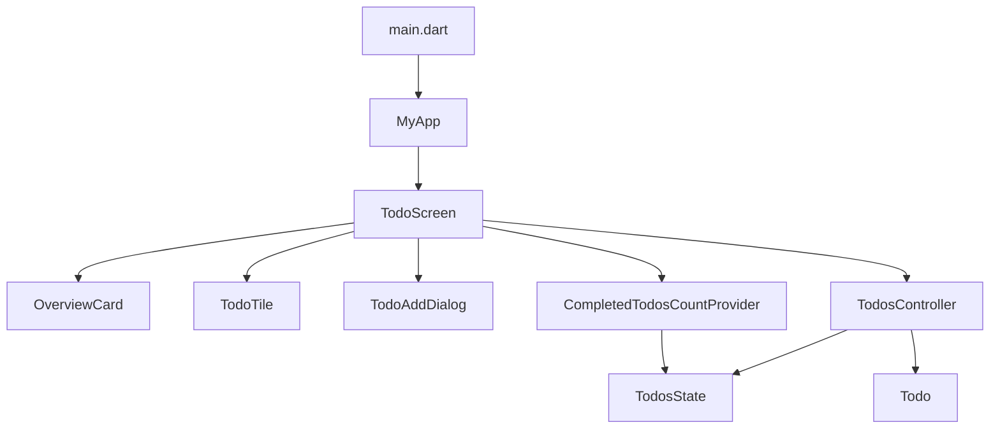
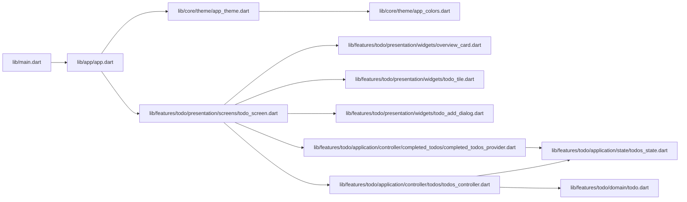
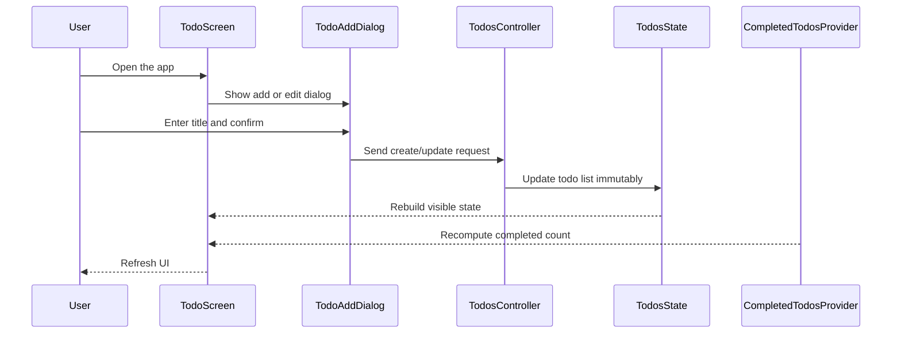

# TickIt

TickIt is a Flutter todo application built around a feature-first, layered architecture. Its purpose is to keep the codebase easy to read and extend, especially for the next developer who needs to understand how screens, state, domain models, and shared UI infrastructure connect.

## Project purpose

The app currently centers on a single feature: managing todos through create, toggle, update, and delete actions. The structure is intentionally organized so future features can be added without mixing UI code, state logic, and business rules.

## Tech stack

- Flutter SDK with Dart
- Material 3 UI system
- State management with Riverpod
- Code generation with Riverpod annotations, Freezed, and Build Runner
- Linting and quality checks with flutter_lints and riverpod_lint
- Cross-platform targets: Android, iOS, Linux, macOS, Windows, and Web
- UI assets and icons via Cupertino icons

## Architecture overview

The codebase follows a layered structure with a clear separation of concerns:

- app/: app shell and top-level composition
- core/: reusable design system elements such as theme and colors
- features/: business features isolated by domain
- main.dart: app bootstrap and provider initialization

Each feature is organized into four conceptual layers:

- presentation/: screens, dialogs, and reusable widgets
- application/: providers, controllers, and state handling
- domain/: immutable business models and rules
- data/: future persistence and repository boundaries

## High-level flow



## File connection graph



## Runtime interaction



## Visual module map

```text
lib/
├── main.dart
├── app/
│   └── app.dart
├── core/
│   └── theme/
│       ├── app_colors.dart
│       └── app_theme.dart
└── features/
    └── todo/
        ├── application/
        │   ├── controller/
        │   │   ├── completed_todos/
        │   │   │   └── completed_todos_provider.dart
        │   │   └── todos/
        │   │       └── todos_controller.dart
        │   └── state/
        │       └── todos_state.dart
        ├── domain/
        │   └── todo.dart
        ├── presentation/
        │   ├── screens/
        │   │   └── todo_screen.dart
        │   └── widgets/
        │       ├── overview_card.dart
        │       ├── todo_add_dialog.dart
        │       └── todo_tile.dart
        └── data/
```

## Mindmap of the codebase


## Project structure and responsibilities

### 1. Root entry points

- lib/main.dart
  - Bootstraps the Flutter app.
  - Wraps the application in ProviderScope so Riverpod can be used anywhere in the widget tree.

- lib/app/app.dart
  - Defines the root app widget.
  - Applies the dark Material 3 theme and sets TodoScreen as the home screen.

### 2. Shared infrastructure

- lib/core/theme/app_colors.dart
  - Centralizes application color tokens.
  - Keeps theme values consistent across widgets and screens.

- lib/core/theme/app_theme.dart
  - Builds the global ThemeData for the app.
  - Controls scaffold colors, card styling, buttons, inputs, and the dark visual theme.

### 3. Todo feature: domain layer

- lib/features/todo/domain/todo.dart
  - Defines the Todo model.
  - Uses Freezed to create immutable value objects that are easy to copy and compare.

### 4. Todo feature: application layer

- lib/features/todo/application/state/todos_state.dart
  - Holds the current todo list state.
  - Stores loading status and optional error information.

- lib/features/todo/application/controller/todos/todos_controller.dart
  - Main Riverpod controller for todo operations.
  - Handles add, toggle, delete, and update actions.
  - Updates state immutably through copyWith-based transitions.

- lib/features/todo/application/controller/completed_todos/completed_todos_provider.dart
  - Computes the number of completed todos.
  - Keeps derived UI state separate from the main controller state.

### 5. Todo feature: presentation layer

- lib/features/todo/presentation/screens/todo_screen.dart
  - Main screen of the app.
  - Watches todo state and the completed-count provider.
  - Renders empty, loading, error, and populated states.

- lib/features/todo/presentation/widgets/overview_card.dart
  - Displays a summary card for total and completed todo counts.

- lib/features/todo/presentation/widgets/todo_add_dialog.dart
  - Presents the dialog used to create or edit a todo.
  - Validates user input before forwarding it to the controller.

- lib/features/todo/presentation/widgets/todo_tile.dart
  - Renders each todo row.
  - Contains checkbox, title, edit, and delete interactions.

### 6. Todo feature: data layer

- lib/features/todo/data/
  - Reserved for future persistence, repositories, or API adapters.
  - Keeps storage concerns separate from presentation and application logic.

## Developer navigation guide

If you are changing behavior in the app, the most likely starting points are:

- UI changes: lib/features/todo/presentation/
- State and business flow changes: lib/features/todo/application/
- Model changes: lib/features/todo/domain/
- App-wide visual rules: lib/core/theme/

## Implementation notes

- The app already wires the shell, theme layer, and todo feature through Riverpod.
- The core user flow is in place: add todos, toggle completion, edit todos, delete todos, and view progress.
- The current implementation is still evolving around polish and future feature expansion.

## Contribution conventions

- Keep new features under lib/features/<feature>/.
- Keep widgets presentational and avoid embedding business rules in UI code.
- Put state transitions and provider logic in application/.
- Keep domain models immutable and focused on business concepts.
- Treat generated files such as .g.dart and .freezed.dart as build artifacts rather than hand-edited sources.
